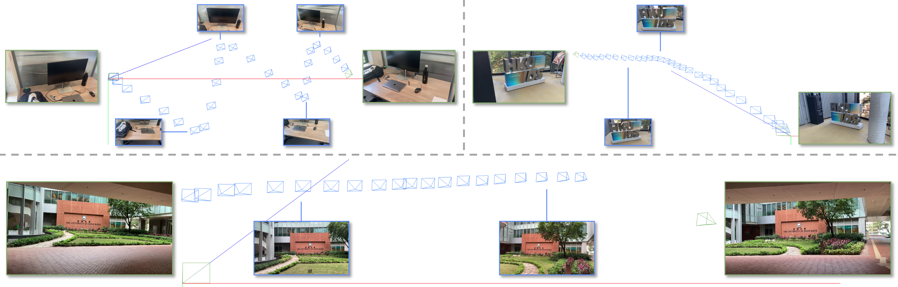

<p align="center">
  <h2 align="center">[CVPR 2025] Reloc3r: Large-Scale Training of Relative Camera Pose Regression for Generalizable, Fast, and Accurate Visual Localization</h2>
 <p align="center">
    <a href="https://siyandong.github.io/">Siyan Dong*</a>
    ·
    <a href="https://ffrivera0.github.io/">Shuzhe Wang*</a>
    ·
    <a href="http://b1ueber2y.me/">Shaohui Liu</a>
    ·
    <a href="">Lulu Cai</a>
    ·
    <a href="https://fqnchina.github.io/">Qingnan Fan</a>
    ·
    <a href="https://users.aalto.fi/~kannalj1/">Juho Kannala</a>
    ·
    <a href="https://yanchaoyang.github.io/">Yanchao Yang</a>
  </p>
  <h3 align="center"><a href="https://arxiv.org/abs/2412.08376">Paper</a> | <a href="">Online Demo (Coming Soon)</a> </h3>
  <div align="center"></div>
</p>

<p align="center">
  <a href="">
    
  </a>
</p>

<p align="center">
<strong>Reloc3r</strong> is a simple yet effective camera pose estimation framework that combines a pre-trained two-view relative camera pose regression network with a multi-view motion averaging module.
</p>
<br>

<p align="center">
  <a href="">
    
  </a>
</p>

<p align="center">
Trained on approximately 8 million posed image pairs, <strong>Reloc3r</strong> achieves surprisingly good performance and generalization ability, producing high-quality camera pose estimates in real-time.
</p>
<be>

## TODO List

- [x] Release pre-trained weights and inference code. 
- [x] Release evaluation code for ScanNet1500, MegaDepth1500 and Cambridge datasets. 
- [x] Release demo code for wild images and videos. 
- [ ] Release evaluation code for other datasets. 
- [ ] Release the accelerated version for visual localization. 
- [ ] Release Gradio Demo.  
- [ ] Release training code and data.


## Installation

1. Clone Reloc3r
```bash
git clone --recursive https://github.com/ffrivera0/reloc3r.git
cd reloc3r
# if you have already cloned reloc3r:
# git submodule update --init --recursive
```

2. Create the environment using conda
```bash
conda create -n reloc3r python=3.11 cmake=3.14.0
conda activate reloc3r 
conda install pytorch torchvision pytorch-cuda=12.1 -c pytorch -c nvidia  # use the correct version of cuda for your system
pip install -r requirements.txt
# optional: you can also install additional packages to:
# - add support for HEIC images
pip install -r requirements_optional.txt
```

3. Optional: Compile the cuda kernels for RoPE 
```bash
# Reloc3r relies on RoPE positional embeddings for which you can compile some cuda kernels for faster runtime.
cd croco/models/curope/
python setup.py build_ext --inplace
cd ../../../
```

4. Download the Reloc3r-224/512 checkpoints from [Google Drive](https://drive.google.com/drive/folders/12C5NxU3ooayGPPJgsINmJNnOmIAxYe7h?usp=sharing) or Hugging Face [Reloc3r-224](https://huggingface.co/siyan824/reloc3r-224) [Reloc3r-512](https://huggingface.co/siyan824/reloc3r-512), and place them under `./checkpoints/`. 


## Relative Pose Estimation on ScanNet1500 and MegaDepth1500

Download the datasets [here](https://drive.google.com/drive/folders/16g--OfRHb26bT6DvOlj3xhwsb1kV58fT?usp=sharing) and unzip it to `./data/`.
Then run the following script. You will obtain results similar to those presented in our paper.
```bash
bash scripts/eval_relpose.sh
```
<strong>Note:</strong> To achieve faster inference speed, set `--amp=1`. This enables evaluation with `fp16`, which increases speed from <strong>24 FPS</strong> to <strong>40 FPS</strong> on an RTX 4090 with Reloc3r-512, without any accuracy loss.


## Visual Localization on Cambridge

Download the dataset [here](https://drive.google.com/file/d/1XcJIVRMma4_IClJdRq6rwBKX3ZPet5az/view?usp=sharing) and unzip it to `./data/cambridge/`.
Then run the following script. You will obtain results similar to those presented in our paper.
```bash
bash scripts/eval_visloc.sh
```


## Demo for Wild Images 

In the demos below, you can run Reloc3r on your own data. 

For relative pose estimation, try the demo code in `wild_relpose.py`. We provide some [image pairs](https://drive.google.com/drive/folders/1TmoSKrtxR50SlFoXOwC4a9aGr18h00yy?usp=sharing) used in our paper.  

```bash
# replace the args with your paths
python wild_relpose.py --v1_path ./data/wild_images/zurich0.jpg --v2_path ./data/wild_images/zurich1.jpg --output_folder ./data/wild_images/
```

Visualize the relative pose
```bash
# replace the args with your paths
python visualization.py --mode relpose --pose_path ./data/wild_images/pose2to1.txt
```

For visual localization, the demo code in `wild_visloc.py` estimates absolute camera poses from sampled frames in self-captured videos. 

<strong>Important</strong>: The demo uses the first and last frames as the database, which <strong>requires</strong> overlapping regions among all images. This demo does <strong>not</strong> support linear motion. We provide some [videos](https://drive.google.com/drive/folders/1sbXiXScts5OjESAfSZQwLrAQ5Dta1ibS?usp=sharing) as examples. 

```bash
# replace the args with your paths
python wild_visloc.py --video_path ./data/wild_video/ids.MOV --output_folder ./data/wild_video
```

Visualize the absolute poses
```bash
# replace the args with your paths
python visualization.py --mode visloc --pose_folder ./data/wild_video/ids_poses/
```


## Citation

If you find our work helpful in your research, please consider citing: 
```
@article{reloc3r,
  title={Reloc3r: Large-Scale Training of Relative Camera Pose Regression for Generalizable, Fast, and Accurate Visual Localization},
  author={Dong, Siyan and Wang, Shuzhe and Liu, Shaohui and Cai, Lulu and Fan, Qingnan and Kannala, Juho and Yang, Yanchao},
  journal={arXiv preprint arXiv:2412.08376},
  year={2024}
}
```


## Acknowledgments

Our implementation is based on several awesome repositories:

- [Croco](https://github.com/naver/croco)
- [DUSt3R](https://github.com/naver/dust3r)

We thank the respective authors for open-sourcing their code.

